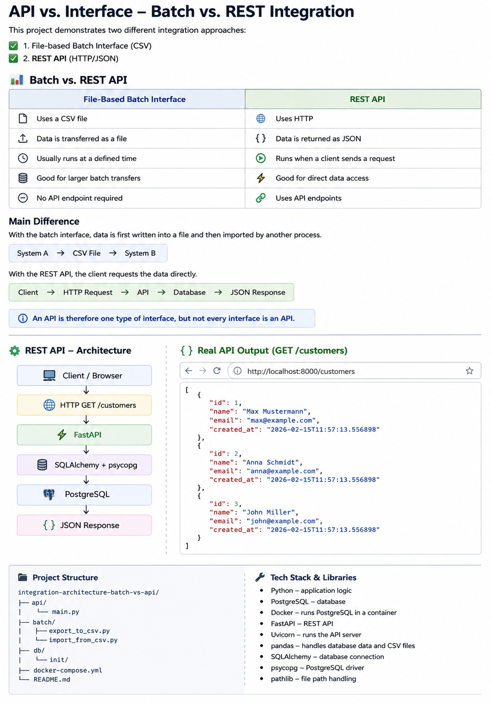

# API vs. Interface – Technical Comparison

This project demonstrates two different integration approaches:

1. **File-based batch interface (CSV)** ✅
2. **REST API (HTTP/JSON)** ✅

The goal is to show the technical difference between a classic file-based interface and a REST API.

---

## Architecture Overview



---

## Part 1: File-Based Batch Interface

The first part simulates data transfer between two systems using a CSV file.

### Process

```text
PostgreSQL
    ↓
export_to_csv.py
    ↓
customers_export.csv
    ↓
import_from_csv.py
    ↓
customers_import
```

### Export (`export_to_csv.py`)

The export script:

- Connects to PostgreSQL
- Reads customer data with SQL
- Exports the data to a CSV file
- Stores the file in `data/outbound`

### Import (`import_from_csv.py`)

The import script:

- Reads the exported CSV file
- Connects to PostgreSQL
- Imports the data into the target table `customers_import`

This simulates a simple file-based data exchange between two systems.

---

## Part 2: REST API

The second part provides customer data through a REST API.

The API was built with **FastAPI**.

### Process

```text
Client / Browser
      ↓
HTTP GET /customers
      ↓
FastAPI
      ↓
SQLAlchemy + psycopg
      ↓
PostgreSQL
      ↓
JSON Response
```

### Endpoint

```text
GET /customers
```

When the client calls this endpoint:

1. FastAPI receives the HTTP GET request.
2. The API connects to PostgreSQL.
3. A SQL query reads the customer data.
4. The data is returned to the client as JSON.

### Example JSON Response

```json
[
  {
    "id": 1,
    "name": "Max Mustermann",
    "email": "max@example.com",
    "created_at": "2026-02-15T11:57:13.556898"
  },
  {
    "id": 2,
    "name": "Anna Schmidt",
    "email": "anna@example.com",
    "created_at": "2026-02-15T11:57:13.556898"
  },
  {
    "id": 3,
    "name": "John Miller",
    "email": "john@example.com",
    "created_at": "2026-02-15T11:57:13.556898"
  }
]
```

---

## Batch vs. REST API

| File-Based Batch Interface | REST API |
|---|---|
| Uses a CSV file | Uses HTTP |
| Data is transferred as a file | Data is returned as JSON |
| Usually runs at a defined time | Runs when a client sends a request |
| Good for larger batch transfers | Good for direct data access |
| No API endpoint required | Uses API endpoints |

### Main Difference

With the **batch interface**, data is first written into a file and then imported by another process.

```text
System A → CSV File → System B
```

With the **REST API**, the client requests the data directly.

```text
Client → HTTP Request → API → Database → JSON Response
```

An API is therefore one type of interface, but not every interface is an API.

---

## Technical Stack

- **Python** – application logic
- **PostgreSQL** – database
- **Docker** – runs PostgreSQL in a container
- **FastAPI** – REST API
- **Uvicorn** – runs the API server
- **pandas** – handles database data and CSV files
- **SQLAlchemy** – database connection
- **psycopg** – PostgreSQL driver
- **pathlib** – file path handling

---

## Libraries Used

### pandas

Reads data from PostgreSQL and handles CSV files.

### SQLAlchemy

Creates and manages the connection between Python and PostgreSQL.

### psycopg

PostgreSQL driver used for communication with the database.

### pathlib

Handles file and folder paths.

### FastAPI

Used to create the REST API and the `/customers` endpoint.

### Uvicorn

Runs the FastAPI application as a web server.

---

## Project Structure

```text
integration-architecture-batch-vs-api/
│
├── api/
│   └── main.py
│
├── batch/
│   ├── export_to_csv.py
│   └── import_from_csv.py
│
├── db/
│   └── init/
│
├── docker-compose.yml
└── README.md
```

---

## What This Project Demonstrates

This project demonstrates two common ways to integrate systems:

**Batch integration**

```text
PostgreSQL → Python → CSV → Python → PostgreSQL
```

**API integration**

```text
Client → HTTP GET → FastAPI → PostgreSQL → JSON
```

Both are interfaces between systems, but they use different methods for data exchange.